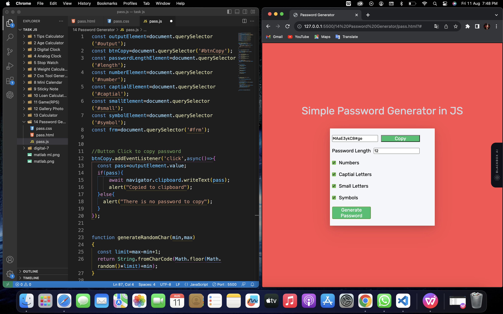

# projectinjs
sticky notes, E-commerce front page, css tool &amp; password generator

# Sticky Note Web Application

This is a simple web application that allows users to create and manage sticky notes. Users can add, edit, and delete sticky notes with ease. The application uses HTML, CSS, and JavaScript to provide this functionality.

## Table of Contents

- [Features](#features)
- [Prerequisites](#prerequisites)
- [Getting Started](#getting-started)
- [Usage](#usage)
- [Contributing](#contributing)
- [License](#license)

## Features

- Create and add new sticky notes to the board.
- Edit the content of existing sticky notes.
- Delete sticky notes from the board.

## Prerequisites

Before you begin, ensure you have met the following requirements:

- A modern web browser.
- A text editor or Integrated Development Environment (IDE) for code editing.

## Getting Started

1. Clone the repository to your local machine:

   ```shell
   git clone <repository-url>
   ```

2. Open the project folder in your text editor or IDE.

## Usage

1. Open the `index.html` file in your web browser.

2. You will see a board with a "Add Note" button. Click the button to create a new sticky note.

3. Double-click on a sticky note to delete it.

4. Edit the content of a sticky note by clicking on it and making changes.

5. Sticky note data is stored in the browser's local storage, so your notes will be saved even if you close the browser.

## Contributing

Contributions are welcome! If you'd like to contribute to this project, please follow these steps:

1. Fork the project.
2. Create your feature branch: `git checkout -b feature/your-feature-name`
3. Commit your changes: `git commit -m 'Add some feature'`
4. Push to the branch: `git push origin feature/your-feature-name`
5. Create a pull request.

---

# Amazon Shopping Website

This is a simple e-commerce website inspired by Amazon, where users can browse and shop for various products. The website is built using HTML, CSS, and Bootstrap for the front-end. It features a responsive design and some sample product listings.

## Table of Contents

- [Features](#features)
- [Prerequisites](#prerequisites)
- [Getting Started](#getting-started)
- [Usage](#usage)
- [Screenshots](#screenshots)
- [Contributing](#contributing)
- [License](#license)

## Features

- Responsive design for both desktop and mobile devices.
- Navigation bar with links to Home, Order, and Login pages.
- Search functionality.
- Sample product listings with images.
- New offer promotion section.

## Prerequisites

Before you begin, ensure you have met the following requirements:

- A web browser to view the website.
- A code editor for making changes to the website (if desired).

## Getting Started

1. Clone the repository to your local machine:

   ```shell
   git clone <repository-url>
   ```

2. Open the project folder in your code editor or simply double-click the `index.html` file to view it in your web browser.

## Usage

1. Navigate to the website's home page by clicking "Home" in the navigation bar.

2. Use the search bar to look for specific products.

3. Explore the sample product listings in different categories.

4. Click on a product to view more details.

5. You can also access the "Order" and "Login" pages from the navigation bar.

## Screenshots

Include screenshots of your website here to provide visual context.

## Contributing

Contributions are welcome! If you'd like to contribute to this project, please follow these steps:

1. Fork the project.
2. Create your feature branch: `git checkout -b feature/your-feature-name`
3. Commit your changes: `git commit -m 'Add some feature'`
4. Push to the branch: `git push origin feature/your-feature-name`
5. Create a pull request.

---

# Password Generator



A simple Password Generator web application built with HTML, CSS, and JavaScript. This tool allows users to generate strong and random passwords with various options.

## Table of Contents

- [Features](#features)
- [Prerequisites](#prerequisites)
- [Getting Started](#getting-started)
- [Usage](#usage)
- [Screenshots](#screenshots)
- [Contributing](#contributing)
- [License](#license)

## Features

- Generate strong and random passwords of variable length.
- Customize password options:
  - Include numbers
  - Include capital letters
  - Include small letters
  - Include symbols
- Copy the generated password to the clipboard with a single click.

## Prerequisites

Before you begin, ensure you have met the following requirements:

- A web browser to run the Password Generator.
- Optionally, a code editor to modify the code or styles.

## Getting Started

1. Clone the repository to your local machine:

   ```shell
   git clone <repository-url>
   ```

2. Open the project folder and launch the `index.html` file in a web browser.

## Usage

1. Adjust the "Password Length" input to specify the desired password length.
2. Check or uncheck the options for numbers, capital letters, small letters, and symbols as needed.
3. Click the "Generate Password" button to create a random password.
4. Click the "Copy" button to copy the generated password to your clipboard.
5. Paste the password into your desired application or website.

## Screenshots

Include screenshots of your Password Generator application to provide visual context.

## Contributing

Contributions are welcome! If you'd like to contribute to this project, please follow these steps:

1. Fork the project.
2. Create your feature branch: `git checkout -b feature/your-feature-name`
3. Commit your changes: `git commit -m 'Add some feature'`
4. Push to the branch: `git push origin feature/your-feature-name`
5. Create a pull request.

---

# CSS Tool Generator

The CSS Tool Generator is a web application that allows you to generate CSS code for customizing the border of an element. This tool is useful for quickly creating CSS styles for borders with different radii, sizes, and styles.

## Table of Contents

- [Features](#features)
- [Prerequisites](#prerequisites)
- [Getting Started](#getting-started)
- [Usage](#usage)
- [Screenshots](#screenshots)
- [Contributing](#contributing)
- [License](#license)

## Features

- Generate CSS code for custom border styles.
- Adjust the border radius, size, and style.
- Copy the generated CSS code to the clipboard with a single click.

## Prerequisites

Before you begin, ensure you have met the following requirements:

- A web browser to run the CSS Tool Generator.
- Optionally, a code editor to modify the generated CSS code.

## Getting Started

1. Clone the repository to your local machine:

   ```shell
   git clone <repository-url>
   ```

2. Open the project folder and launch the `index.html` file in a web browser.

## Usage

1. Adjust the "All Corner" and "Border Size" sliders to customize the border radius and size.
2. Select a border style from the dropdown menu.
3. The generated CSS code will be displayed in the textarea.
4. Click the "Copy Code" button to copy the generated CSS code to your clipboard.
5. Paste the CSS code into your project to apply the border style.

## Screenshots

Include screenshots of your CSS Tool Generator application to provide visual context.

## Contributing

Contributions are welcome! If you'd like to contribute to this project, please follow these steps:

1. Fork the project.
2. Create your feature branch: `git checkout -b feature/your-feature-name`
3. Commit your changes: `git commit -m 'Add some feature'`
4. Push to the branch: `git push origin feature/your-feature-name`
5. Create a pull request.
